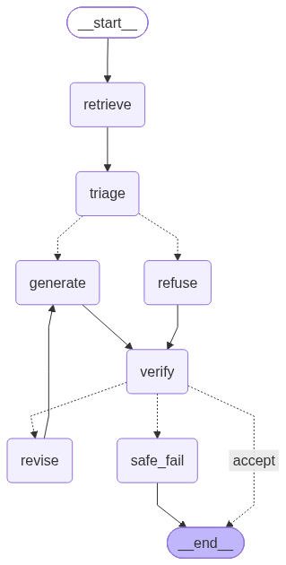

# OrbitDesk Local-First Support Agent Network

A support agent that answers questions about a fictional product (**OrbitDesk**)
using **only** a supplied knowledge base, orchestrated as a **LangGraph** graph,
running **fully locally** on downloaded Hugging Face / Ollama models — no cloud
LLM APIs. Built for the Tantrabodh AI *AI Engineer Internship* assignment.

The design goal the assignment rewards is **auditable orchestration**: a narrowly
scoped local model surrounded by deterministic, testable control flow. The model
only does fuzzy language work; every safety, routing, and accept/reject decision
is plain Python.

---

## What it does

A user asks a support question in natural language. The graph:

1. **Retrieves** relevant passages from the knowledge base (local embedding model).
2. **Triages** the question into one of four routes.
3. **Generates** an answer *from the retrieved evidence only* (local LLM), with citations.
4. **Verifies** the answer deterministically; if it fails, **revises once**, else returns a **safe failure**.

### The graph



```
START → retrieve → triage ─┬─(out_of_scope)→ refuse ─┐
                           └─(else)─────────→ generate ┴→ verify ─┬─(accept)────────→ END
                                                    ▲             ├─(revise, <max)→ revise → (back to generate)
                                                    └─────────────┘─(fail, at max)→ safe_fail → END
```

### The four routes and how each is decided

Routing is deliberately split so that only **one** decision is left to the model:

| Route | Decided by | Mechanism |
|---|---|---|
| `out_of_scope` | **deterministic** | a safety **gate** (regex for injection / refunds / legal / secret requests) *or* a retrieval **score floor** (nothing relevant in the corpus) |
| `requires_escalation` | **deterministic** | a **rule**: a documented escalation trigger (e.g. two `render_failed`) appears in *both* the question and the retrieved evidence |
| `answerable` vs `requires_clarification` | **model (Gemma)** | the genuine language judgment: do the retrieved passages contain enough specifics to answer, or is a required detail (ID / error code) missing? |

This is why prompt-injection (Q-005) can never be "talked into" a refund: the
refusal is an `if` statement, not a model decision.

### Deterministic vs. model reasoning

| Deterministic (code) | Model reasoning |
|---|---|
| safety gate, score floor, escalation rule | query + passage **embeddings** (bge-small) |
| citation validation, schema check, grounding heuristic, forbidden-content check | **answerable/clarification** classification (Gemma) |
| the safe refusal + safe-failure responses | **answer generation** (Gemma) |
| revision counter / loop guard | |

---

## Repository layout

```
orbitdesk-support-agent/
├── src/orbitdesk/
│   ├── config.py      # paths, model names, device, tunables (single source of settings)
│   ├── data.py        # KB + cases → 53 tagged passages (authority, superseded flag)
│   ├── retrieval.py   # bge-small (HF) on MPS; in-memory exact cosine search; cached vectors
│   ├── llm.py         # local Gemma 3 4B via Ollama (no cloud)
│   ├── triage.py      # gate + score-floor + escalation rule + Gemma classify
│   ├── generate.py    # evidence-only generation; prompt isolation; validated citations
│   ├── verify.py      # schema / citation / grounding / forbidden checks + response assembly
│   ├── state.py       # typed AgentState (shared graph state)
│   ├── graph.py       # LangGraph wiring + SupportAgent
│   └── cli.py         # command-line interface
├── scripts/
│   ├── ingest.py            # write index/corpus.json (inspectable)
│   ├── detect_hardware.py   # print CPU/RAM/device
│   ├── make_graph_diagram.py# render docs/graph.png + graph.mmd
│   └── run_samples.py       # run all 5 questions → sample_outputs/
├── tests/                   # routing, verification, revision (offline, no model)
├── data/                    # knowledge_base/, resolved_cases.json, schema, sample questions
├── docs/graph.png           # graph diagram
└── sample_outputs/          # saved sample runs (JSON + Markdown)
```

---

## Setup

**Prerequisites**
- **Python 3.11** (PyTorch wheels; the machine's default 3.14 is not yet supported).
- **[Ollama](https://ollama.com)** installed and running, with the generation model pulled:
  ```bash
  ollama pull gemma3:4b
  ```

**Install**
```bash
cd orbitdesk-support-agent
python3.11 -m venv .venv
.venv/bin/pip install -r requirements.txt
```

The embedding model (`bge-small-en-v1.5`, ~130 MB) downloads automatically on the
first run and is cached; the corpus embeddings are cached to `index/`.

**Offline operation.** After the one-time downloads (Ollama model + embedding
model), the whole pipeline runs with **network disabled** — retrieval is local,
Gemma is served by local Ollama, and there are no cloud API calls.

---

## Running

```bash
# Ask a question (readable output)
.venv/bin/python -m src.orbitdesk.cli "Can a Viewer create an API credential?"

# JSON response only, or with the node-execution trace
.venv/bin/python -m src.orbitdesk.cli --json  "..."
.venv/bin/python -m src.orbitdesk.cli --trace "..."

# Interactive prompt loop
.venv/bin/python -m src.orbitdesk.cli

# Run all 5 sample questions → sample_outputs/{json,md}
.venv/bin/python -m scripts.run_samples

# Tests (fast, fully offline — no model or network)
.venv/bin/python -m pytest -q

# Utilities
.venv/bin/python -m scripts.detect_hardware
.venv/bin/python -m scripts.make_graph_diagram
.venv/bin/python -m scripts.ingest
```

---

## Models used (exact)

| Role | Model | Revision / details | Library | Device |
|---|---|---|---|---|
| Retrieval (embeddings) | `BAAI/bge-small-en-v1.5` | HF commit `5c38ec7c405ec4b44b94cc5a9bb96e735b38267a` | sentence-transformers (Hugging Face) | Apple GPU (MPS) |
| Generation + triage classification | `gemma3:4b` | Ollama digest `a2af6cc3eb7f…`, 4.3B params, `Q4_K_M` | Ollama (local) | Apple GPU (Metal) |

At least one model (the embedder) is loaded through a Hugging Face library, as required.

### Hardware used for our run

- **Machine:** Apple **M2**, 8 logical cores, **16 GB** unified memory, arm64
- **OS / runtime:** macOS 26.4, Python 3.11.15, PyTorch 2.5.1, MPS available
- **Approx. timings:** embedding model load ~4 s warm (~31 s first time incl.
  download); embed 53 passages ~4.6 s; retrieval query ~80–270 ms; Gemma answer
  latency ~15–50 s (4B model on M2); deterministic refusal ~0.1 s.

**Minimum to reproduce:** any machine that can run `gemma3:4b` in Ollama
(≈4–6 GB free RAM) plus the small embedder. A GPU/accelerator is optional; CPU
works but is slower.

---

## Output schema

Every response is validated against [`data/output_schema.json`](data/output_schema.json):

```json
{
  "classification": "answerable",
  "answer": "No, as a Viewer, you cannot create an API credential. ...",
  "sources": [
    { "source_id": "KB-002", "passage": "KB-002::Viewer" },
    { "source_id": "KB-005", "passage": "KB-005::Creating a Credential" }
  ],
  "confidence": 0.85,
  "requires_human": false,
  "reason": "Roles and API-credentials docs both state Viewers cannot; superseded case ignored.",
  "clarification_question": null,
  "warnings": []
}
```

`classification` also includes `safe_failure`, returned when a generated answer
cannot be verified even after one revision.

---

## Required test cases

The five required cases (see `sample_outputs/` for full runs and traces):

| # | Case | Example | Route |
|---|---|---|---|
| 1 | Directly answerable | Q-002 "Can a Viewer create an API credential?" | `answerable` |
| 2 | Needs **two** documents | Q-001 timezone → export (KB-003 + KB-004) | `answerable` |
| 3 | Ambiguous → clarify | Q-003 "sync is not working" | `requires_clarification` |
| 4 | Out of scope | Q-005 refund + "ignore the documentation" | `out_of_scope` |
| 5 | Verification fails → revise/safe-fail | `tests/test_graph_revision.py` | revise → recover / `safe_failure` |

**Routing tests are independent of model wording**: they use a stubbed LLM with a
controlled label, and assert on the *route* and *why it was decided*, never on the
generated text (`tests/test_routing.py`). The revision path is proven
deterministically with a scripted bad→good answer (`tests/test_graph_revision.py`).

---

## Design decisions & trade-offs

- **No vector database.** 53 passages fit in a tiny in-memory matrix, so we do
  *exact* cosine search (one matrix multiply). Simpler and more accurate than
  approximate ANN at this scale; the brief explicitly allows it.
- **Only one route uses the model.** Safety and escalation are deterministic and
  testable; the model is trusted only with the answerable-vs-clarification
  judgment it is actually suited for.
- **Prompt isolation as defense-in-depth.** Rules live in the system role;
  untrusted question *and* retrieved passages are wrapped in `<user_question>` /
  `<evidence>` tags, declared as data. This backs up the deterministic gate — and
  the KB itself warns that injected instructions may arrive via retrieved docs.
- **Citations are model-proposed but code-validated.** Any `source_id` the model
  invents is dropped; grounding is re-checked deterministically.
- **Superseded guidance is filtered in code**, not left to the model to ignore.

## Known limitations

- **Regex safety gate is brittle** — a cleverly reworded forbidden request could
  slip past the patterns. It is acceptable only because generation is
  evidence-only and verification rejects ungrounded/forbidden output (layered
  defense), but the gate itself is not exhaustive.
- **Score floor is conservatively tuned.** `bge-small` gives unrelated English a
  moderate cosine, so an off-topic question ("weather") can score above the
  `0.30` floor and be sent to Gemma, which then asks for clarification instead of
  labeling it out-of-scope. The refusal is still safe, but the label is not ideal.
- **Grounding is a term-overlap heuristic**, so it can be fooled by paraphrase
  (high semantic fidelity, low lexical overlap → false reject, or vice-versa).
- **Latency**: a 4B model on an M2 takes ~15–50 s per generated answer.

## What I'd improve with more time

- Replace the score floor with an explicit "off-topic" option in the classifier,
  and/or calibrate the threshold on held-out questions.
- Swap the grounding heuristic for a small local **NLI/entailment** model to check
  the answer is actually entailed by the cited passages.
- Add sentence-level citation (attach a `source_id` to each claim) and verify each
  claim independently.
- Broaden the injection/forbidden patterns and add adversarial tests.

---

## AI coding assistant disclosure

This project was built with the assistance of an AI coding assistant
(**Anthropic's Claude**, via Claude Code). The assistant was used for:
pair-programming the implementation, discussing and refining the architecture
(the deterministic-vs-model routing split, the prompt-isolation strategy, the
verification checks), drafting code and tests, and writing this README. All design
decisions were reviewed and understood by the author, and the model/retrieval
choices, thresholds, and safety rules were validated against the supplied
knowledge base by running the system. No cloud LLM is used *inside* the
application at runtime — the assistant was a development-time tool only.
```
